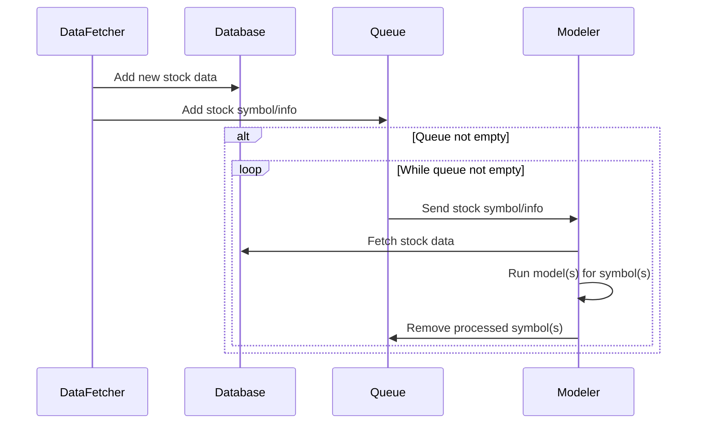

```mermaid
sequenceDiagram
    participant DataFetcher
    participant Database
    participant Queue
    participant Modeler

    DataFetcher->>Database: Add new stock data
    DataFetcher->>Queue: Add stock symbol/info
    alt Queue not empty
        loop While queue not empty
            Queue->>Modeler: Send stock symbol/info
            Modeler->>Database: Fetch stock data
            Modeler->>Modeler: Run model(s) for symbol(s)
            Modeler->>Queue: Remove processed symbol(s)
        end 
    end
```
