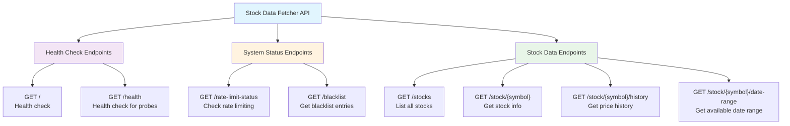
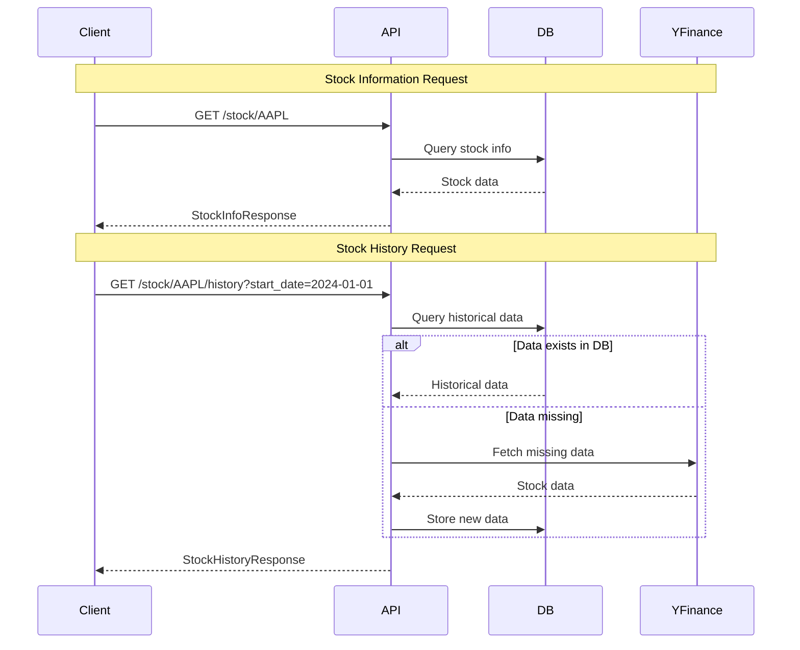

# Stock Data Fetcher API Endpoints

## API Endpoint Architecture



## Detailed Endpoint Documentation

### 🏥 Health Check Endpoints

| Method | Endpoint | Description | Response |
|--------|----------|-------------|----------|
| GET | `/` | Root health check | Service status and version info |
| GET | `/health` | Kubernetes health probe | Simple OK status |

### ⚙️ System Status Endpoints

| Method | Endpoint | Parameters | Description |
|--------|----------|------------|-------------|
| GET | `/rate-limit-status` | - | Check if service is rate limited |
| GET | `/blacklist` | `ticker` (optional) | Get blacklisted tickers |

### 📈 Stock Data Endpoints

#### List Stocks
```
GET /stocks
```
**Response**: List of all available stocks in database

#### Get Stock Information
```
GET /stock/{symbol}
```
**Parameters**:
- `symbol` (path) - Stock symbol (e.g., AAPL)

**Response**: Comprehensive stock information

#### Get Stock History
```
GET /stock/{symbol}/history
```
**Parameters**:
- `symbol` (path) - Stock symbol
- `start_date` (query, optional) - Start date (YYYY-MM-DD)
- `end_date` (query, optional) - End date (YYYY-MM-DD)
- `ishourly` (query, optional) - True for hourly, False for minute data
- `limit` (query) - Max records (1-10000, default: 1000)
- `offset` (query) - Records to skip (default: 0)

**Response**: Stock price history data

#### Get Date Range
```
GET /stock/{symbol}/date-range
```
**Parameters**:
- `symbol` (path) - Stock symbol

**Response**: Available date range for the stock

## Data Flow Diagram



## Response Models

### StockInfoResponse
- Basic stock information
- Company details
- Current price data

### StockHistoryResponse
- Historical price data
- Pagination metadata
- Date range information

## Error Handling

| Status Code | Description |
|-------------|-------------|
| 200 | Success |
| 400 | Bad Request (invalid parameters) |
| 404 | Stock not found |
| 500 | Internal server error |

## Rate Limiting

The service implements rate limiting to prevent abuse:
- Rate limit status can be checked via `/rate-limit-status`
- When rate limited, service returns appropriate status
- Reset time is provided in the response

## Data Sources

- **Primary**: Database (PostgreSQL)
- **Fallback**: yfinance API
- **Coverage**: 2 years hourly + 1 month minute data